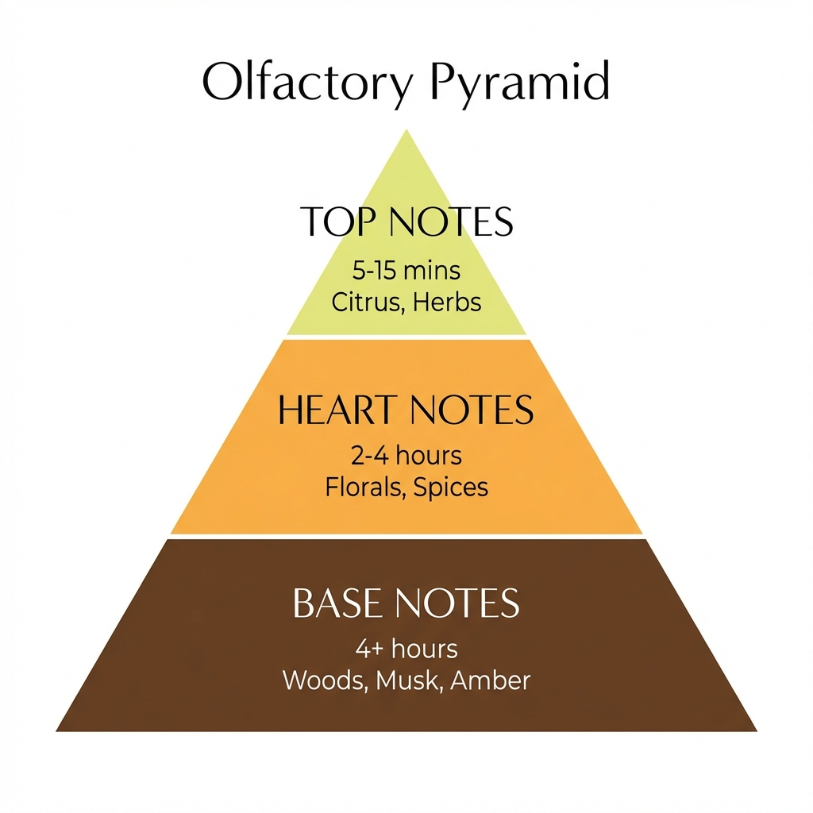
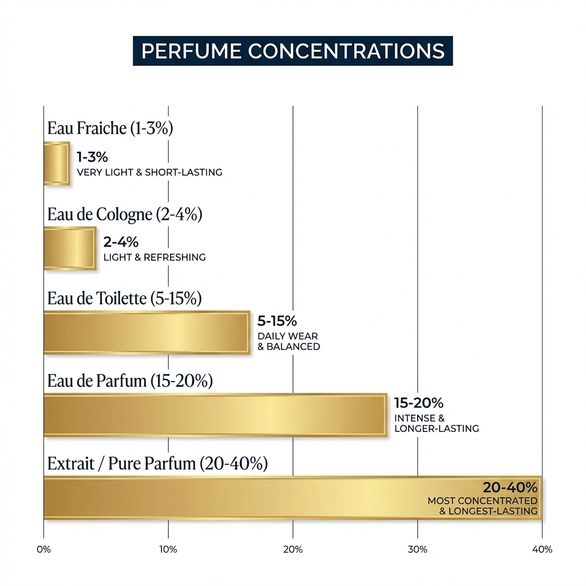

# Module 01: Fundamentals of Scent

Before you can truly appreciate a fragrance, you must understand how it is constructed and how it performs.

## 1. The Olfactory Pyramid
Most fragrances are designed to evolve over time. This evolution is described as the "olfactory pyramid."

### Top Notes (The Opening)
*   **What they are**: The lightest, most volatile molecules. They evaporate quickly.
*   **Role**: They create the first impression and "sell" the perfume.
*   **Common notes**: Citrus (bergamot, lemon), light fruits, fresh herbs.
*   **Duration**: 5–15 minutes.

### Heart / Middle Notes (The Core)
*   **What they are**: The main body of the fragrance. They emerge as the top notes dissipate.
*   **Role**: They define the character of the scent.
*   **Common notes**: Floral (rose, jasmine), spices (cinnamon, pepper), greener fruits.
*   **Duration**: 2–4 hours.

### Base Notes (The Dry Down)
*   **What they are**: Heavy, large molecules that evaporate very slowly.
*   **Role**: They provide depth and solidity, fixing the scent to the skin.
*   **Common notes**: Woods (cedar, sandalwood), musk, amber, vanilla, resins.
*   **Duration**: 4+ hours (sometimes days).

---

## 2. Concentrations
The longevity and intensity of a fragrance depend largely on the concentration of aromatic oils in the alcohol/water base.

| Concentration | Oil % | Longevity | Usage |
| :--- | :--- | :--- | :--- |
| **Eau Fraîche** | 1–3% | < 1 hour | Refresher, post-gym |
| **Eau de Cologne (EdC)** | 2–4% | 2 hours | Light splash, summer heat |
| **Eau de Toilette (EdT)** | 5–15% | 3–5 hours | Daily wear, office safe |
| **Eau de Parfum (EdP)** | 15–20% | 5–8 hours | Evening, dates, all-day |
| **Extrait de Parfum** | 20–40% | 8–24+ hours | Special occasions, intimate |

*Note: Higher concentration doesn't always mean "louder" projection; Extraits often sit closer to the skin but last longer.*

---

## 3. Key Terminology

*   **Sillage** (pronounced *see-yahzh*): The trail of scent left behind by a perfume as you move. A "beast mode" fragrance has enormous sillage.
*   **Projection**: How far the scent radiates from your skin. Does it stay in your "scent bubble" or fill the room?
*   **Dry Down**: The final phase of the perfume's life on your skin (mostly base notes).
*   **Accord**: A blend of several notes that creates a new, unified scent impression (e.g., a "leather accord" might be made of birch tar, styrax, and labdanum).
*   **Nose / Perfumer**: The artist who creates the fragrance.
*   **Flanker**: A variation of an existing successful perfume (e.g., *Acqua di Gio* -> *Acqua di Gio Profumo*).
