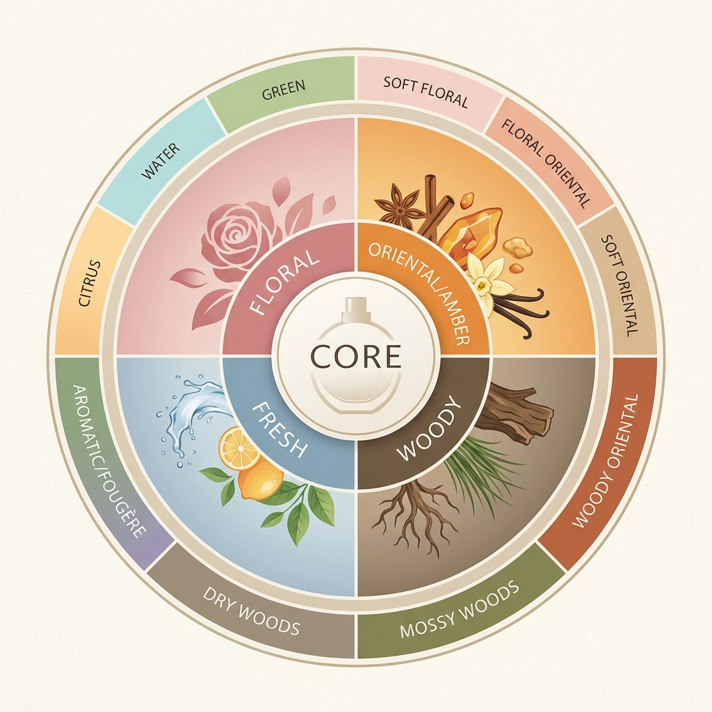

# Module 02: Olfactory Families

Understanding families helps you articulate what you like and find similar scents. The most common classification system is the **Fragrance Wheel**.

## 1. The Big Four

### Fresh
*   **Character**: Zesty, clean, sparkling, aquatic.
*   **Vibe**: "Just out of the shower," energizing, sporty.
*   **Key Notes**: Lemon, bergamot, grapefruit, sea salt, cut grass.
*   **Sub-categories**: Citrus, Water/Aquatic, Green.
*   **Iconic Examples**: *Acqua di Gio*, *CK One*, *Dior Sauvage (opening)*.

### Floral
*   **Character**: Romantic, powdery, sweet, complex.
*   **Vibe**: Classic femininity, though increasingly popular in masculine scents (esp. rose/iris).
*   **Key Notes**: Rose, jasmine, lily, tuberose, iris.
*   **Sub-categories**: Soliflore (one flower), Floral Bouquet.
*   **Iconic Examples**: *Chanel No. 5*, *Marc Jacobs Daisy*.

### Oriental (Amber)
*   **Character**: Warm, spicy, resinous, sensual.
*   **Vibe**: Mysterious, seductive, cozy, winter-ready.
*   **Key Notes**: Vanilla, amber, cinnamon, clove, incense.
*   **Sub-categories**: Soft Oriental, Woody Oriental.
*   **Iconic Examples**: *YSL Opium*, *Shalimar*, *Tom Ford Tobacco Vanille*.

### Woody
*   **Character**: Earthy, dry, reliable, grounding.
*   **Vibe**: Sophisticated, masculine, natural.
*   **Key Notes**: Cedarwood, sandalwood, vetiver, patchouli.
*   **Sub-categories**: Mossy Woods, Dry Woods.
*   **Iconic Examples**: *Terre d'Hermès*, *Bleu de Chanel*.

---

## 2. Distinctive Sub-Families

### Fougère ("Fern-like")
*   **The Barbershop Scent**. The most classic masculine family.
*   **Structure**: Lavender (top) + Oakmoss (base) + Coumarin/Tonka (base).
*   **Vibe**: Clean, groomed, shaving cream.
*   **Examples**: *Drakkar Noir*, *Penhaligon's Sartorial*, *Houbigant Fougère Royale*.

### Chypre ("Cyprus")
*   **The Sophisticated Choice**. Dry and mossy with a fresh opening.
*   **Structure**: Bergamot (top) + Labdanum (heart) + Oakmoss (base).
*   **Vibe**: Classy, austere, powerful "boss" scents.
*   **Examples**: *Creed Aventus* (modern chypre), *Guerlain Mitsouko*.

### Gourmand
*   **The Edible Scent**. A modern category (post-1990s) that smells like dessert.
*   **Key Notes**: Chocolate, coffee, caramel, cotton candy, honey.
*   **Vibe**: Playful, comforting, sweet.
*   **Examples**: *Thierry Mugler Angel*, *Kilian Black Phantom*.
