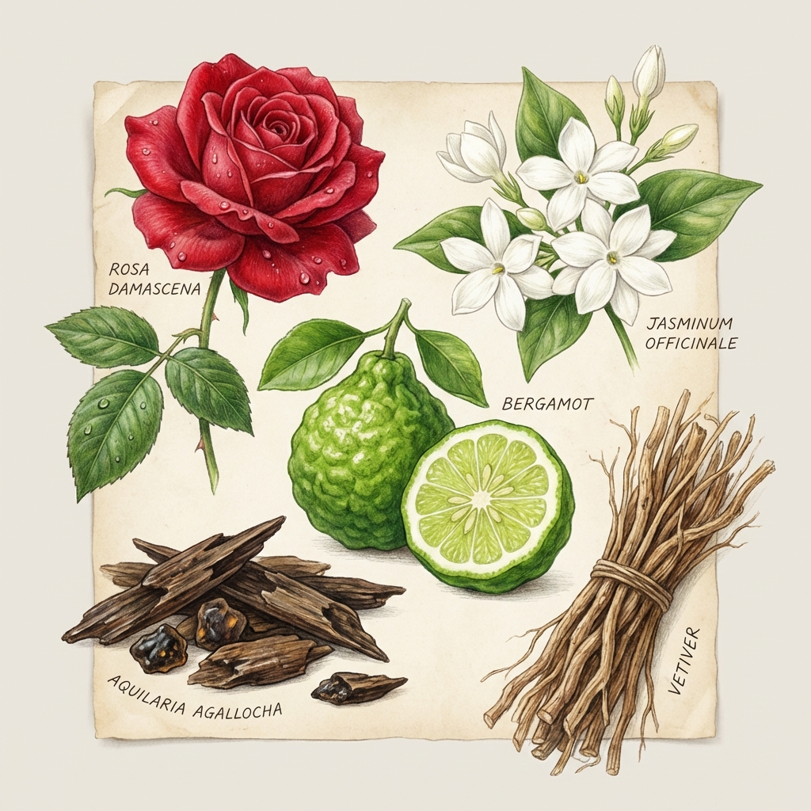

# Module 03: Ingredients & Raw Materials

Perfume is a blend of art and chemistry.

## 1. Naturals vs. Synthetics

There is a common misconception that "Natural is better." In modern perfumery, this is rarely true.

### Naturals
*   **Pros**: incredible complexity, depth, and nuance.
*   **Cons**: Expensive, inconsistent batches (crop varies by year), high allergen potential, often restricted by IFRA (regulations).
*   **Examples**: Rose absolute, Jasmine sambac, Vetiver oil.

### Synthetics
*   **Pros**: Stability, longevity, ethical alternatives (musk), creating scents that don't yield oil (lily of the valley, sea breeze, ozone).
*   **Cons**: Can smell "harsh" if cheap or used poorly.
*   **Reality**: **All** great modern perfumes use a mix. Synthetics provide the structure and "lift" (like Iso E Super or Ambroxan) that allows naturals to shine.

---

## 2. Iconic Notes You Should Know

### Rose
*   **Profile**: Can be dewy/green, powdery/sweet, or dark/jammy.
*   **Major types**: Damask Rose (spicy/deep), Centifolia (sweet/honeyed).

### Jasmine
*   **Profile**: Intensely floral, narcotic, sometimes "indolic" (a slightly animalic/decaying note that adds depth).
*   **Vibe**: Seductive and heady.

### Vetiver
*   **Profile**: A grass root. Earthy, grassy, smoky, dry, woody.
*   **Vibe**: The backbone of masculine elegance.

### Oud (Agarwood)
*   **What is it?**: Resin formed in Aquilaria trees when infected by mold.
*   **Profile**: Complex, animalic, woody, medicinal, sweet.
*   **Status**: "Liquid Gold." Real oud is incredibly expensive; most commercial oud is a synthetic accord.

### Bergamot
*   **What is it?**: An inedible citrus fruit (cross between lemon and bitter orange).
*   **Profile**: The finest citrus note. Complex, floral, spicy, and tart.
*   **Use**: Found in the top notes of almost every fragrance (especially Earl Grey tea).

### Ambergris
*   **What is it?**: Waxy substance from the sperm whale.
*   **Profile**: Marine, salty, musky, skin-like.
*   **Modern Use**: Almost exclusively replaced by **Ambroxan** (synthetic), which gives a clean, salty, mineral projection.

### Musk
*   **History**: Originally from the musk deer (now banned).
*   **Modern Use**: "White Musks" (synthetic) are used to make scents smell clean, soapy, and soft (like clean laundry). "Dirty Musks" mimic the animalic original.
