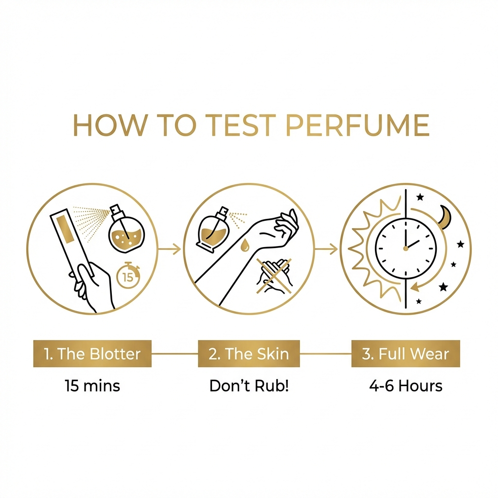
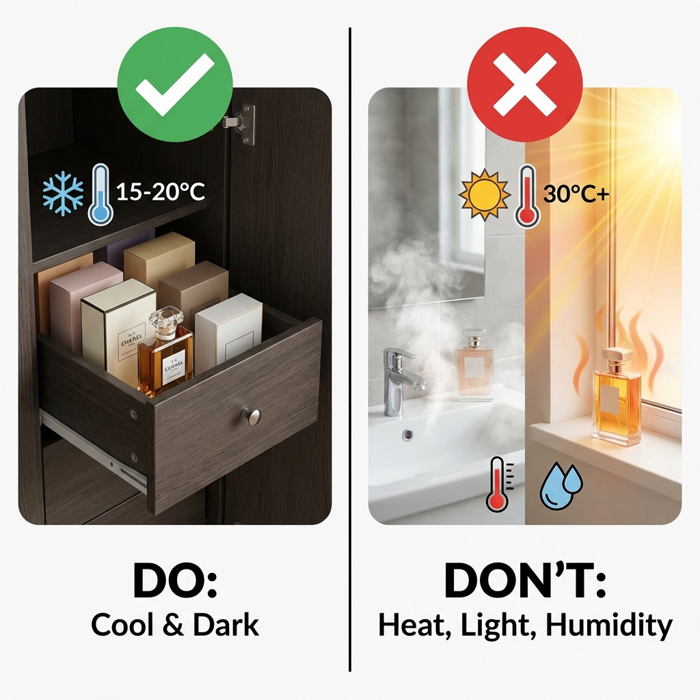

# Module 04: Selection & Usage Guide

How to find a scent you love and wear it well.

## 1. The Testing Protocol

**Never buy a perfume after smelling only the opening.**

1.  **The Blotter (Paper Strip)**: Spray the strip. Wave it to let alcohol evaporate. Smell.
    *   *Like it?* -> Save the strip, write the name on it. Wait 15 mins (Heart notes).
    *   *Still like it?* -> Proceed to skin.
2.  **The Skin Test**: Spray your wrist or inner elbow. **Do not rub your wrists together.** (This creates heat friction which can crush the top notes and alter the evaporation).
3.  **The Full Wear**: Live with it for at least 4-6 hours. Walk around, go outside.
    *   Does it turn sour on your skin? (Skin chemistry is real).
    *   Does it disappear in 30 minutes?
    *   Does the dry down give you a headache?

## 2. Building a Wardrobe

You don't need 50 bottles. A solid 3-bottle rotation covers most bases:

1.  **The Daily Driver (Signature)**
    *   Versatile, inoffensive, clean. Something you can wear to work or the grocery store.
    *   *Family*: Woody, Citrus, or light Fougère.
2.  **The Warm / Evening**
    *   For dates, dinners, or colder weather. Something with more projection and depth.
    *   *Family*: Oriental, Spicy, Gourmand.
3.  **The Wildcard / Statement**
    *   For specific moods or events where you want to be noticed.
    *   *Family*: Leather, heavy Oud, niche artistic scents.

## 3. Application & Storage

### where to Spray
*   **Pulse Points**: Neck, behind ears, wrists, inside elbows. Heat radiates from these points, pushing the scent out.
*   **Hair/Clothes**: Holds scent longer than skin, but doesn't "evolve" as much. Be careful of staining clothes with dark-colored juices (blue/amber liquids).

### How to Store

*   **The Enemy**: LIGHT, HEAT, HUMIDITY.
*   **Bathroom**: The worst place (humidity swings).
*   **Window Sill**: The second worst place (UV light destroys molecules).
*   **Best Place**: A cool, dark drawer, closet, or wine cooler.

### Does Perfume Expire?
Technically, yes (3-5 years). Practically? If stored in the dark and cool, they can last decades. Top notes (citrus) might fade, but the heart often gets richer (maceration).
