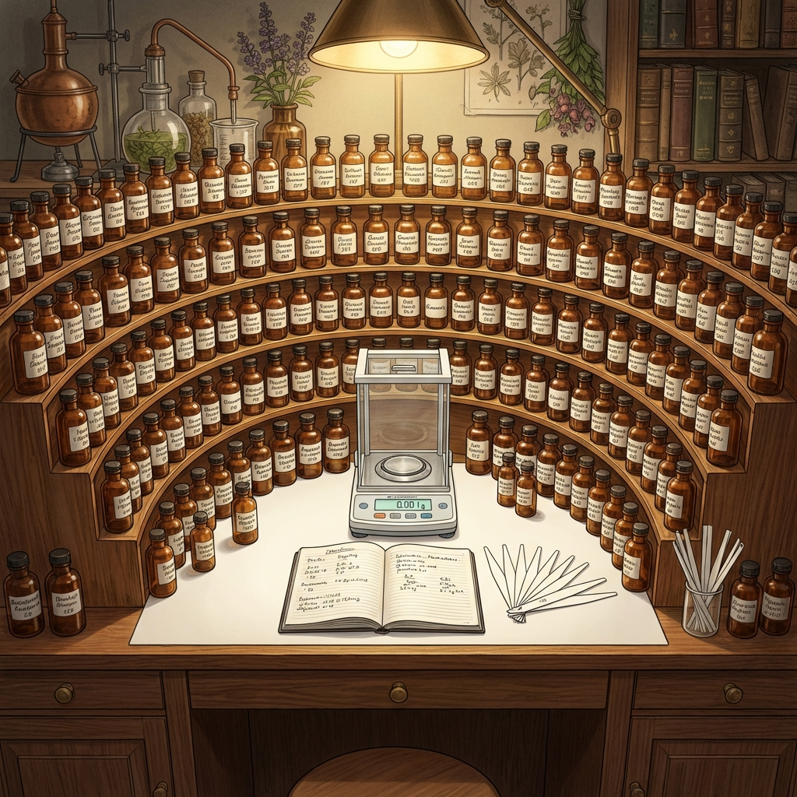

# Module 05: Becoming a Perfumer

So you want to move from *smelling* to *creating*? Welcome to the lab.

## 1. The Paths to the Profession

### The Classical Route (The Big Schools)
If you want to work for major houses (Givaudan, Firmenich, IFF) and create the next Dior or Chanel blockbuster, you need a degree.
*   **ISIPCA (Versailles, France)**: The Harvard of perfumery. Requires a chemistry degree and fluency in French/English.
*   **Givaudan School (Argenteuil)**: Extremely competitive (Takes ~5 students/year). Free, but you are bonded to the company.

### The Indie Route (Self-Taught)
Many modern niche stars (like Andy Tauer) are self-taught.
*   **Pros**: Total creative freedom. No corporate briefs.
*   **Cons**: No mentorship. Sourcing materials is hard. Expensive startup costs.

---

## 2. Setting Up Your Lab (The Organ)

A perfumer's workspace is called an **Organ** (because the tiered shelves look like a church organ).

### Essential Equipment
1.  **The Scale**: Must be accurate to **0.01g** (modern) or **0.001g** (professional). Drops are not a unit of measurement!
2.  **Pipettes**: Disposable plastic ones for transferring liquids.
3.  **Scent Strips (Mouillettes)**: For testing.
4.  **Raw Materials**:
    *   **Essential Oils**: Naturals (Bergamot, Rose, Cedar).
    *   **Aroma Chemicals**: Synthetics (Iso E Super, Hedione, Vanillin).
5.  **Diluents**: Perfumer's Alcohol (SDA 40B) or DPG (Dipropylene Glycol) for oils.

---

## 3. The Jean Carles Method

How do you learn? You don't just mix random things. You use the method developed by Jean Carles (creator of *Miss Dior*).

### Step 1: Odor Profiling
Study ONE material at a time. Smell it at 100%, 10%, and 1%. Write down everything:
*   **Evaporation Curve**: How does it smell after 1 min? 1 hour? 1 day?
*   **Character**: Is this rose "spicy" or "sweet"?

### Step 2: The Accord
Mix just TWO materials.
*   Create a ratio series: 1:9, 5:5, 9:1.
*   Find the "perfect balance" where they create a third, new scent.

### Step 3: The Skeleton
Build a simple structure (Base + Heart + Top) and then dress it with modifiers.

---

## 4. Safety & Regulation (IFRA)

Perfume is chemistry. Some things are dangerous.
*   **IFRA (International Fragrance Association)**: They set the safety limits.
*   **Allergens**: Oakmoss, Clove (Eugenol), and Citrus (sun sensitivity) have strict limits.
*   **Rule #1**: Never test on skin until you have calculated the safety limits of your formula.
