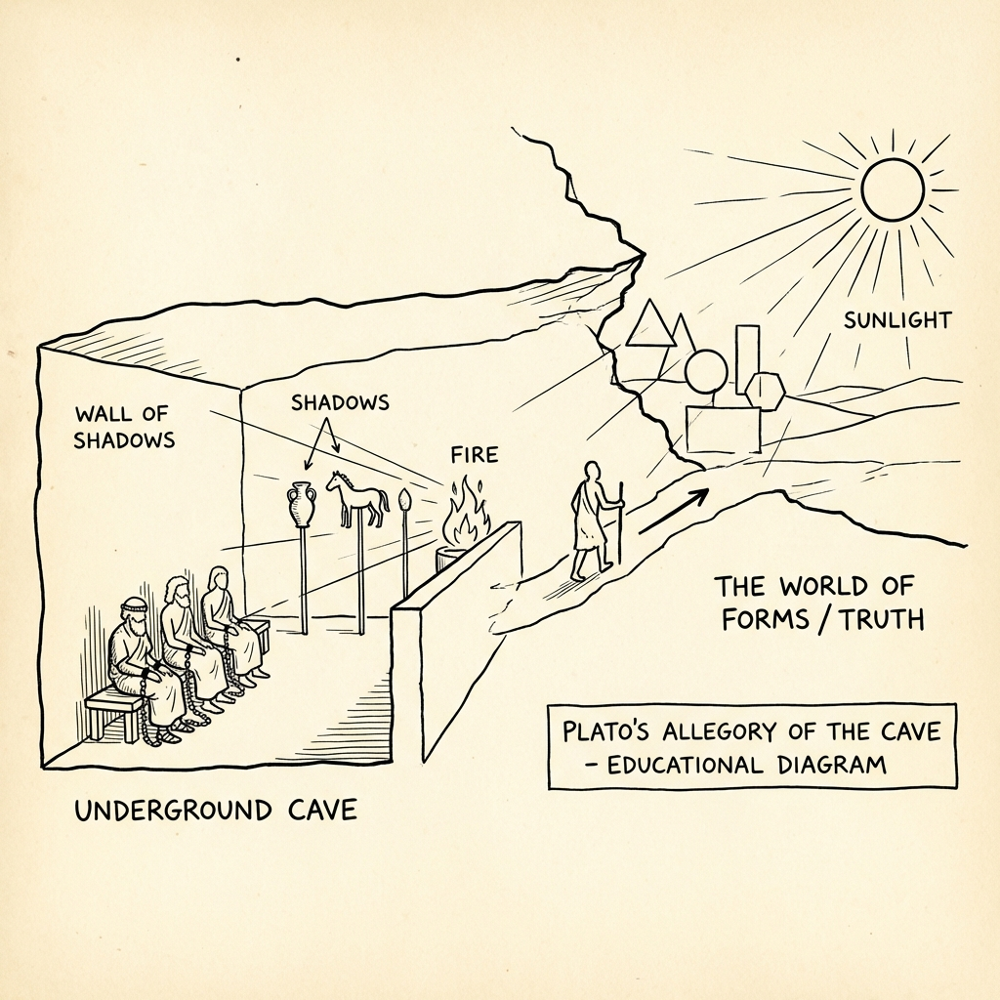

# Module 01: The Greeks

The "Big Three" of Athens laid the groundwork for Western logic, science, and ethics.

## 1. Socrates (470–399 BC)
**The Gadfly of Athens.** Socrates wrote nothing down; we know him through his student, Plato.

*   **The Socratic Method**: Teaching by asking questions. He didn't claim to know the answers; he just wanted to expose ignorance and contradiction.
*   **Core Idea**: *“The only true wisdom is in knowing you know nothing.”*
*   **Key Takeaway**: Question your assumptions. Don't accept "common sense" without tearing it apart first.

## 2. Plato (427–347 BC)
**The Idealist.** A student of Socrates. He believed the world we see is just a shadow of a higher reality.

*   **The Allegory of the Cave**: Imagine prisoners chained in a cave, seeing only shadows on the wall. They think the shadows are real. One escapes, sees the sun (Truth), and returns to tell the others. They think he is crazy.
*   **Theory of Forms**: There is a "perfect" version (Form) of everything (Justice, Beauty, a Chair) in a higher realm. Our world is just imperfect copies.
*   **Key Takeaway**: Don't trust your senses blindly; seek the deeper, abstract truth behind appearances.

## 3. Aristotle (384–322 BC)
**The Realist.** A student of Plato (but disagreed with him). He was a scientist at heart.

*   **Empiricism**: Truth is found *in* the world, through observation and classification.
*   **Virtue Ethics**: Goodness isn't a rule; it's a character trait cultivated by habit. "We are what we repeatedly do."
*   **The Golden Mean**: Virtue is the midpoint between two extremes (vices).
    *   *Cowardice* <--- **Courage** ---> *Rashness*
    *   *Stinginess* <--- **Generosity** ---> *Wastefulness*
*   **Key Takeaway**: Aim for balance. Excellence is a habit, not an act.
