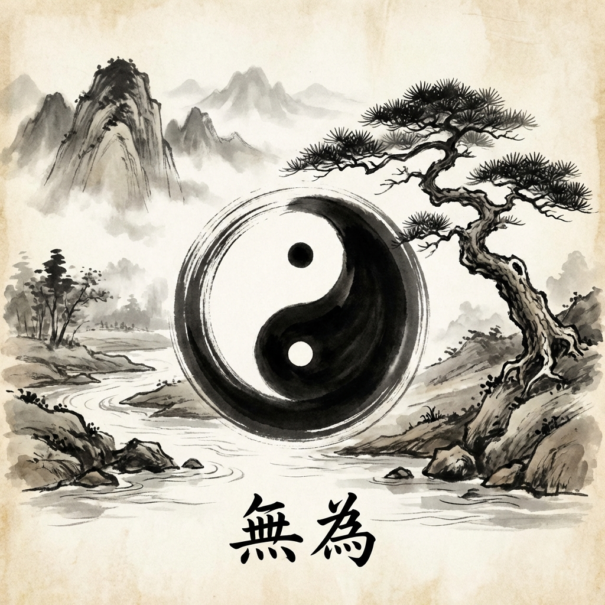

# Module 02: Eastern Wisdom

While the Greeks focused on Logic and Individualism, the East focused on Harmony, Flow, and Connection.

## 1. Confucius (551–479 BC)
**The Architect of Society.** Living in a time of chaos, he wanted to restore order through ritual and respect.

*   **Filial Piety (Xiao)**: Respect for parents and ancestors is the root of all virtue.
*   **Ritual (Li)**: Social interactions (bowing, tea, manners) aren't empty; they are the glue that holds society together.
*   **The Superior Man (Junzi)**: The goal of life is to become a person of noble character who improves society.
*   **Key Takeaway**: Duty matters. Your role in the family and community defines who you are.

## 2. Lao Tzu (6th Century BC)
**The Old Master.** The founder of Taoism (Daoism). The counter-balance to Confucius.

*   **The Tao (The Way)**: The mysterious, flowing force of the universe. You cannot define it ("The Tao that can be spoken is not the eternal Tao").
*   **Wu Wei (Non-Action)**: Not "laziness," but effortless action. Swimming *with* the current, not against it. A tree bends in the wind and survives; a stiff branch breaks.
*   **Key Takeaway**: Stop forcing things. Be flexible. Let nature take its course.

## 3. The Buddha (Siddhartha Gautama, c. 5th Century BC)
**The Awakened One.** He diagnosed the human condition as one of dissatisfaction.

*   **The Four Noble Truths**:
    1.  Life is Dukkha (Suffering/Unsatisfactoriness).
    2.  The cause of Dukkha is Tanha (Craving/Attachment).
    3.  There is an end to suffering (Nirvana).
    4.  The path to the end is the Eightfold Path.
*   **Impermanence (Anicca)**: Nothing lasts. Suffering comes from trying to hold on to things that must change.
*   **Key Takeaway**: Let go. Attachment is the root of your pain.
