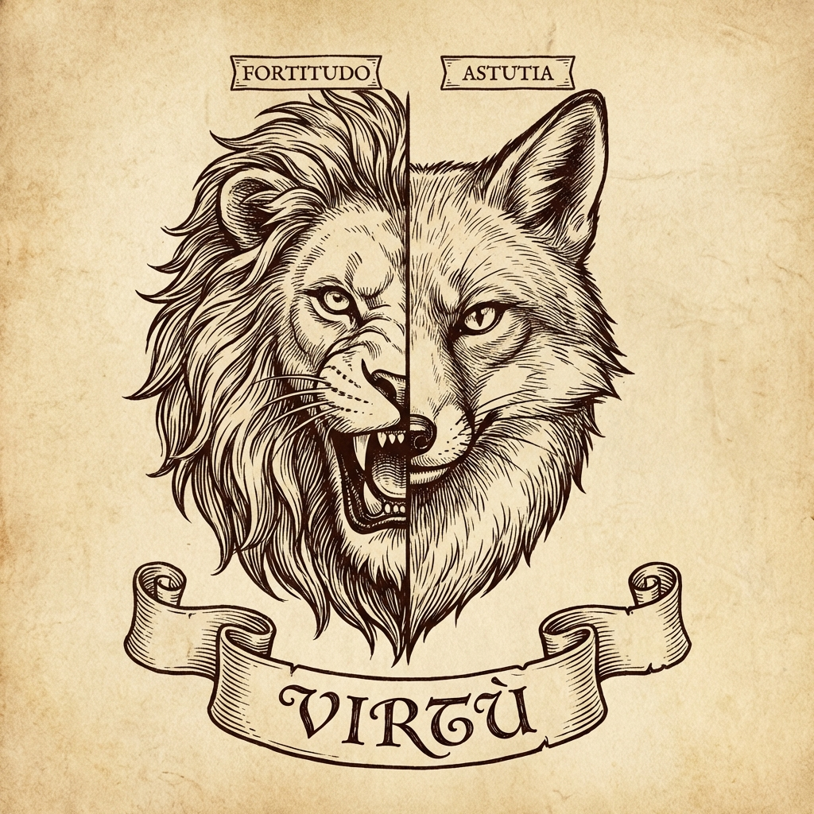

# Module 05: Machiavelli & Realpolitik

Niccolò Machiavelli (1469–1527) is often misunderstood. He wasn't "evil"; he was a realist. He wrote *The Prince* not to tell kings how they *should* behave, but to describe how they *must* behave to survive.

## 1. The Goal: Stability
Machiavelli lived in a time of constant war and chaos in Italy.
*   **The Prime Directive**: The ruler's #1 job is to maintain the state. If the state collapses, everyone suffers. Therefore, actions that prevent collapse are "virtuous," even if they are cruel.
*   **Realpolitik**: Dealing with the world as it *is*, not as you wish it were.

---

## 2. The Fox and The Lion
A famous metaphor from Chapter 18. A Prince must have two natures:

### The Fox
*   **Role**: To recognize traps.
*   **Quality**: Cunning, strategy, deception, diplomacy.
*   **Why**: A lion cannot protect himself from traps (plots, alliances, hidden enemies).

### The Lion
*   **Role**: To scare off wolves.
*   **Quality**: Brute force, authority, military might.
*   **Why**: A fox is defenseless against direct aggression.

**Key Lesson**: You must be adaptable. If you are only a Lion, you will be outsmarted. If you are only a Fox, you will be crushed.

---

## 3. Love vs. Fear
The age-old question: *Is it better to be loved or feared?*

*   **Ideally**: Both.
*   **The Reality**: It is difficult to combine them.
*   ** The Answer**: If you must choose, **it is safer to be feared than loved.**
    *   *Reason*: Love is held by a chain of obligation which is broken whenever it serves a man's purpose. Fear is preserved by the dread of punishment which never fails.
*   **The Warning**: You must **avoid being hated**.
    *   Fear is respect. Hatred causes rebellion.
    *   How to avoid hatred? Don't steal your subjects' property or their women. "Men forget the death of their father sooner than the loss of their inheritance."

---

## 4. Virtù vs. Fortuna

*   **Fortuna (Luck)**: A destructive river that can flood and destroy everything. It controls about half our actions.
*   **Virtù (Skill/Prowess)**: The ability to build dykes and dams *before* the flood comes.
*   **Lesson**: You cannot control luck, but you can prepare for it. A wise leader is never "surprised" by changing winds.
